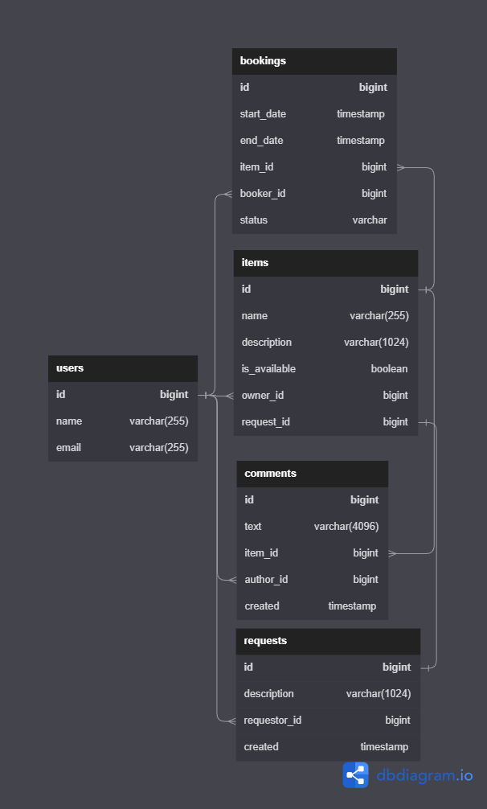

# Проект ShareIt

### Диаграмма БД

  
  
------ 
### Описание БД

**Таблица users**  
Информация о пользователях:

    id — идентификатор (первичный ключ);
    name — имя или логин пользователя;
    email — электронная почта

**Таблица bookings**  
Информация о бронированиях:

    id — уникальный идентификатор бронирования (первичный ключ);
    start_date — дата и время начала бронирования;
    end_date — дата и время окончания бронирования;
    item_id — идентификатор вещи, которую пользователь бронирует (внешний ключ - отсылает к таблице items);
    booker_id — идентификатор пользователя, который осуществляет бронирование (внешний ключ - отсылает к таблице users);
    status_id — статус бронирования (WAITING — новое бронирование, ожидает одобрения, 
                                     APPROVED — бронирование подтверждено владельцем, 
                                     REJECTED — бронирование отклонено владельцем, 
                                     CANCELED — бронирование отменено создателем)
    
**Таблица items**  
Информация о вещах:

    id — уникальный идентификатор вещи (первичный ключ);
    name — краткое название;
    description — развёрнутое описание;
    is_available — статус о том, доступна или нет вещь для аренды;
    owner_id — идентификатор владельца вещи (внешний ключ - отсылает к таблице users);
    request_id — идентификатор запроса. 
                 Если вещь была создана по запросу другого пользователя, то в этом поле будет храниться ссылка 
                 на соответствующий запрос (внешний ключ - отсылает к таблице requests)

**Таблица comments**  
Отзывы по результатам использования вещей:

    id — уникальный идентификатор комментария (первичный ключ);
    text — содержимое комментария;
    item_id — вещь, к которой относится комментарий (внешний ключ - отсылает к таблице items);
    author_id — автор комментария (внешний ключ - отсылает к таблице users);
    created — дата создания комментария

**Таблица requests**  
Информация о запросах на вещи:

    id — уникальный идентификатор запроса (первичный ключ);
    description — текст запроса, содержащий описание требуемой вещи;
    requestor_id — идентификатор пользователя, создавшего запрос (внешний ключ - отсылает к таблице users)
    created — дата создания запроса